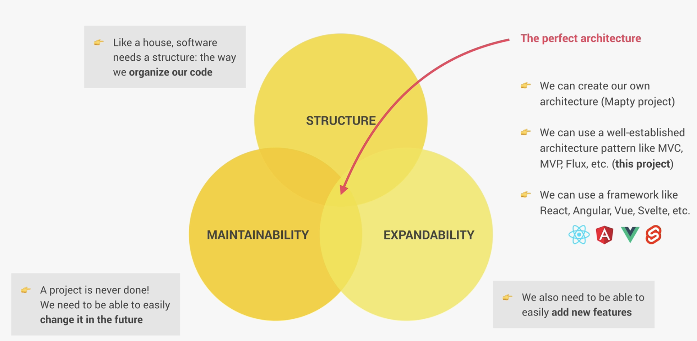
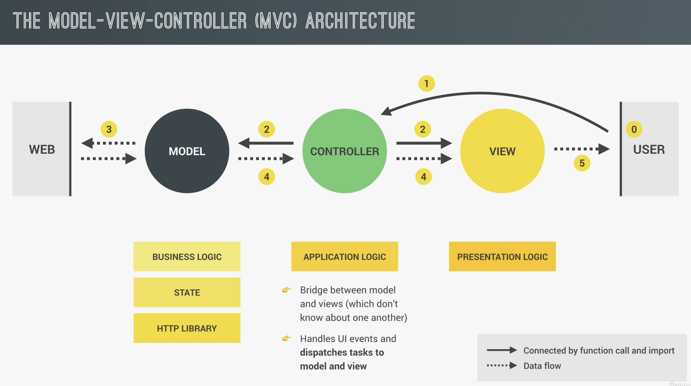

*Lecture 303: The MVC Architecture*

## MVC Architecture

### What is MVC
It's a way to structure our code. For example, like a house needs plumbing, wiring and foundation (**Model**) which is the appilcation's data and logic (business logic, state & HTTP Library)— it knows what's happening and handles it, but users don't see it directly. Model can also contain the HTTP Library which is used to fetch data from some API or back end. Then we have the walls, paint, furniture, and decorations (**View**) which is the presentation logic: what the **user** sees and **interacts with** — the visual part. Lastly, we have the interior design of the house (**Controller**) which is the application logic where we decide what to do when the user clicks a button or types something. It tells the Model to update the data and tells the View to refresh the display. It works like a bridge 🌉 between model and views (which don't know one another).

* One of the main goals of MVC architecture is to speerate business logic from application logic - which allegedly makes developement easier.

* It's important to learn JavaScript well before switching to some of these frameworks. That includes implementing an achritecture by yourself (e.g. Mapty Project - Section 15).

    

### Components of any architecture
* **Business Logic**: Code that solves the real-life problem and is directly related to the solution.

* **State**: Storage of all the duseful data fetched e.g. API fetch, user inputs, what page the user is currently viewing. Also called "*single source of truth*". UI should be kept in sync with the state (difficult task). There are state libraries e.g. [Redux](https://redux.js.org/), [MobX](https://mobx.js.org/README.html)

* **HTTP Library**: Responsible for making and receiving AJAX requests which is always necessary in real-world apps e.g. 
    ```js
    fetch('http://some_url');
    ```
* **Application Logic (Router)**: Code that is only responsible for the implementation of the app itself like handling navigation and UI events.
* **Presentation Logic (UI Layer)**: Code that implements the visible part of the app. Displays the application state - kept in sync with the state layer.

### Example
Let's analyze a user click event:
```js 
addEventListener("click", (event) => {});
```

0. User clicks a button. 
0. The controller handles the click event (application logic).
0. The handling might contain:
    1. updating the user interface (View) 
    1. or asking the Model for some data
    Basically, here the Controller dispatches tasks to the controller and to the view. **It controls the entire outcome/reaction of the given action** (*button click*) and therefore the whole application itself.
0. Then the Model might make some AJAX call in order to receive data.
0. When the data arrives the Controller takes the data and sends it to the view.
0. Finally, the View will terminate this whole lifecycle by rendering that data to the UI.

    