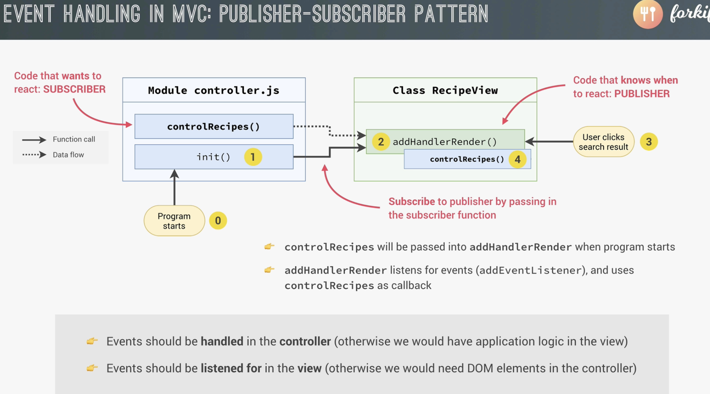

*306. Event Handlers in MVC: Publisher-Subscriber Pattern*

### Event handling in MVC: Publisher-Subscriber (Pub-Sub) Pattern 
The Publisher-Subscriber (Pub-Sub) Pattern is a design pattern used in software development to decouple components. It allows for a one-to-many relationship between objects — where one object (the publisher) notifies many other objects (the subscribers) when something happens. The key benefit: publishers don’t need to know anything about the subscribers, making the system more modular and flexible.

***A publisher emits events. A subscriber listens for those events and reacts.*** Think of the ```View``` as a news outlet (publisher), and the ```Controller``` as a subscriber to notifications. The outlet (```View```) doesn’t know who is subscribed — it just fires the event (publishes). The ```Controller``` provides its callback (handler) to receive and act on the news.

In our case, the ```View``` acts as the publisher — it listens for DOM events and notifies the controller (the subscriber) by calling a function the controller provides.

Example
```js
// recipeView.js (PUBLISHER)
addHandlerRender(handler) {
  ['hashchange', 'load'].forEach(ev =>
    window.addEventListener(ev, handler)
  );
}
```

```js
// controller.js (SUBSCRIBER)
import recipeView from './views/recipeView.js';

const controlRecipes = async function () {
  // Load and render logic
};
```

✅ Benefits of Pub-Sub in MVC apps:

* Prevents tight coupling between view and controller
* Makes your code more reusable and testable
* Keeps UI code (DOM) in the View and business logic in the Controller
* Follows Separation of Concerns principle

### Applying Sub-Pub to Forkify project
#### The problem
The problem is (*Lecture 306*) that we don't want the code below inside the ```controller.js``` but inside the ```viewRecipe.js```.

```js
['hashchange', 'load'].forEach(event =>
  window.addEventListener(event, controlRecipes)
);
```
### Two *solutions* that are bad practise
This is because the code has more to do with DOM manipuilation rather than the controller. However, inside this code block we need to have access to the function ```controlRecipe()```. Again, we don't want to put ```controlRecipe()``` in recipeView as it's a controller-specific functionality. We strictly handle events in the ```Controller``` because otherwise we would have application login in the ```View```. On the other hand, we want to listen for events in ```View``` because otherwise we would need DOM elements inside the ```Controller```:

```js
// ./controller.js (bad practice for MVC ❌ )

const btnIncrease = document.querySelector('.btn--increase-servings');
btnIncrease.addEventListener('click', function () {
  // Some logic to increase servings
  console.log('Increasing servings...');
});
```
* The controller is now dependent on specific DOM structure.
* It tightly couples the controller to the UI, making it harder to refactor or reuse.
* It makes testing and maintenance harder because controller logic is mixed with UI specifics

#### Solution: Sub-Pub pattern
We have 2 components and 1 task here:
0. Code that wants to react: ***SUBSCRIBER***.
0. Code that knows when to react: ***PUBLISHER***.

Task: Subscribe to publisher by passing in the subscriber function
